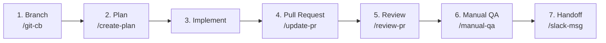

# Claude Harness

This repository contains my Claude Code setup — a collection of specialized agents and skills that automate and standardize my development workflow, from picking up a ticket to requesting a code review.

The goal is to make every delivery follow the same quality gates: a validated plan before any code is written, an automated review before any human review, and full traceability between the ClickUp card, the pull request, and the Slack review request.

## Repository structure

| Directory | Contents |
|---|---|
| `agents/` | Specialized subagents — code review, test coverage, code reuse, and security analysis — invoked by the skills below. |
| `skills/` | Slash commands that orchestrate each stage of the workflow. |
| `shared/` | Conventions referenced by multiple skills, such as the commit structure rules. |
| `docs/` | Supporting material — the workflow slide deck. |

## Tooling

Alongside the agents and skills, my setup runs [rtk](https://www.rtk-ai.app/) — a CLI proxy wired into Claude Code as a shell hook. Every command the assistant runs (`git`, `gh`, `find`, `grep`, `pnpm`, `docker`, ...) goes through it, and rtk compresses the output before it reaches the model's context. The result is a significant token saving on every session, with no change to how the workflow below operates.

## Development workflow

> 🎞️ Prefer slides? The same flow is available as an HTML presentation: [`docs/workflow-presentation.html`](docs/workflow-presentation.html) — download and open in a browser, navigate with `←` `→`.

### 1. Branch creation — `/git-cb <ticket-id>`

Given a ClickUp ticket ID, the skill reads the card (title and description), identifies the nature of the change (new feature, bug fix, chore, refactor), and creates a branch named `<type>/<clickup-id>-<short-description>` — e.g. `feat/868g584nb-date-table`. It then moves the ClickUp card to **"in progress"** automatically, so the board reflects reality the moment work starts.

### 2. Planning — `/create-plan`

Before any code is written, this skill produces a structured implementation plan for the card:

- it reads the **full ticket** first (description, comments, attachments, subtasks) and asks clarifying questions if anything is ambiguous;
- it explores the codebase so the plan fits existing conventions instead of creating parallel patterns;
- a reuse agent checks what already exists before anything new is proposed — including code that should be **promoted to shared packages** instead of duplicated;
- a security agent surfaces requirements early (tenant scoping, webhook validation, secrets/PII handling) when the card touches those surfaces;
- the plan is guided by YAGNI, pragmatic DRY, and TDD — steps are ordered test-first, and the **typed commit sequence** (`test:`, `feat:`, `docs:`, ...) is already laid out per file.

The output follows a fixed format: context, approach, reused code, affected files, implementation steps, test scenarios, risks, **out-of-scope items**, and concrete verification commands. Once validated, the plan is **saved to `.plans/<card-id>.md`** (git-ignored locally) — so implementation can resume in another session, and `/split-plan` can break it into individually shippable feature files when the work benefits from that — optionally mirroring the split into ClickUp as a parent card with one subtask per slice. I then review the plan to confirm the approach makes sense and no requirement was missed. **Implementation only starts after the plan is validated** — this is the main checkpoint for catching gaps while they are still cheap to fix.

### 3. Implementation

The validated plan is executed, following the team's engineering standards (test-driven development, typed commits, scoped changes).

### 4. Pull request — `/update-pr`

Once the implementation is complete, the pull request is opened and this skill standardizes it end to end:

- sets a **SEMVER-formatted title** (`feat(web-app): ...`) following the shared commit conventions;
- fills in the **Criteria of Done**, the ClickUp card link, and a "What this does" section explaining the change and why it exists;
- adds tables for any **environment variables** added or removed (`.env.sample` / CI config);
- addresses any existing review comments, ensures I am the assignee, and mentions `@claude` to trigger the automated reviewer.

Reviewers and product stakeholders get full context without leaving the PR.

### 5. Automated + manual review — `/review-pr`

Before requesting a human review, I run a multi-agent review on my own PR — scoped strictly to the branch's changes — covering security, API contracts, design patterns, simplicity, test coverage, dead code, and (when the diff touches LLM/agent code) agentic-systems quality. Findings come back as a **severity report** (Critical / High / Medium / Low); I choose which ones become **inline comments on the PR**, and nothing is posted without my approval. I complement it with a manual pass over my own changes. The review is also model-tiered: cheap models gather context and post the approved comments mechanically, the session's smartest model does the actual judging on the raw diff, and the security agent is pinned to a model that handles security content reliably. The intent is that human reviewers spend their time on design decisions, not on issues automation can catch.

### 6. Manual QA — `/manual-qa`

With the automated review done, this skill generates a step-by-step manual QA guide for the change: prerequisites, how to perform the key action, sequential test scenarios with concrete inputs and expected outputs, a quick validation table, and troubleshooting. I then walk through the product by hand to confirm the change behaves as intended — automation proves the code is sound; this step proves the feature actually works.

### 7. Review handoff — `/slack-msg`

Finally, this skill prepares the handoff: it marks the PR as **ready for review** if it is still a draft, ensures a structured status comment exists on the ClickUp card (creating one if missing), and generates a concise, human-sounding review request with the PR and card links. The skill only writes the message — **I post it in our review channel myself**, closing the loop: the card, the PR, and the review request all stay in sync.
